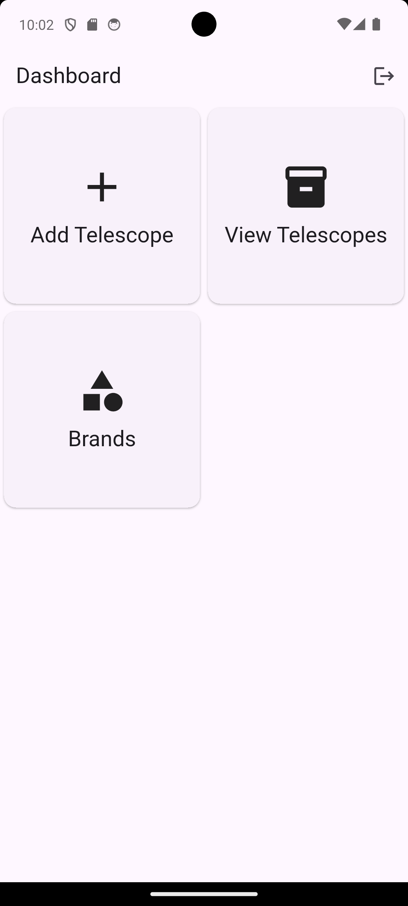
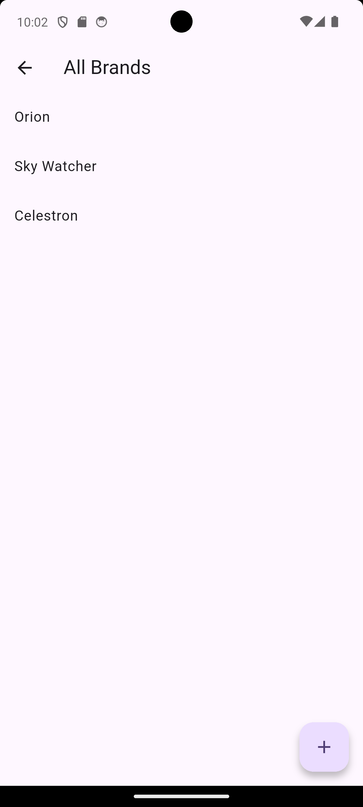
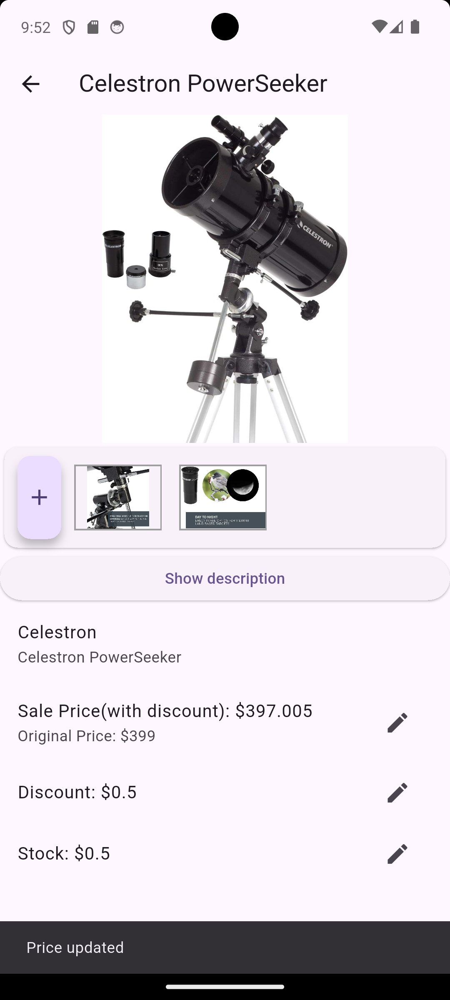
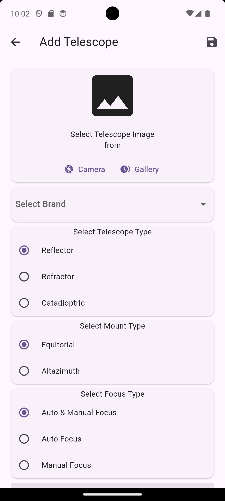
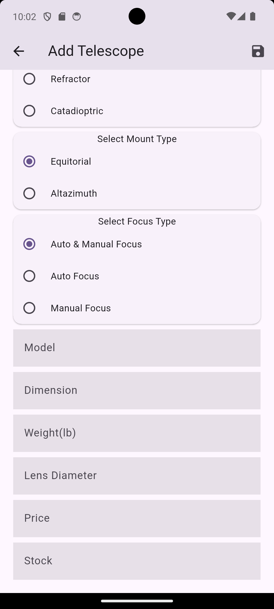
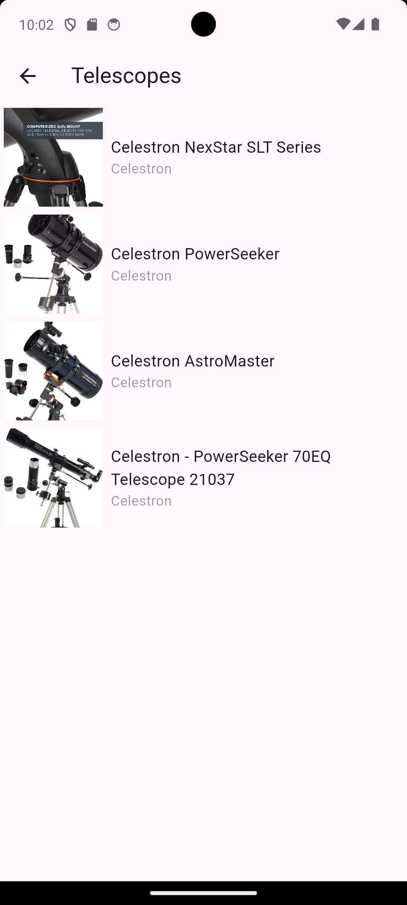
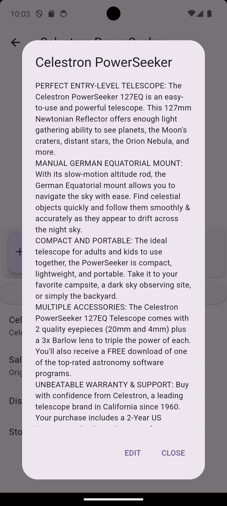
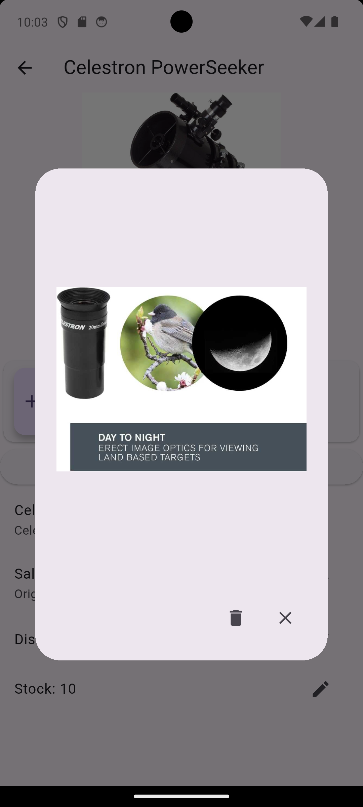

# 🔭 Telescope Mart

Telescope Mart is a comprehensive Flutter-based admin application designed for managing a telescope inventory. Built as a hands-on project to master Flutter and modern backend integrations, it serves as a robust platform for inventory control, featuring authentication, brand management, and detailed product catalogs.

## 🚀 Key Features

- **Admin Authentication**: Secure login system powered by Firebase Auth to restrict access to inventory management.
- **Inventory Dashboard**: A centralized view for an overview of the telescope collection.
- **Brand Management**: Add and organize telescope brands.
- **Telescope CRUD**: Full Create, Read, Update, and Delete capabilities for telescope products, including technical specifications like mount type, focus type, and optical design.
- **Hybrid Backend Integration**:
  - **Firebase Firestore**: Stores structured data for brands and telescopes with real-time updates.
  - **Supabase Storage**: Efficiently handles image uploads and storage for product visuals.
- **Dynamic Routing**: Sophisticated navigation and deep linking using `GoRouter`.
- **Modern State Management**: Efficient state handling across the app using the `Provider` pattern.
- **Advanced Data Modeling**: Leveraging `Freezed` and `JsonSerializable` for immutable models and seamless JSON mapping.

## 📸 Screenshots

| Dashboard | Add Brand | Telescope Details |
| :---: | :---: | :---: |
|  |  |  |

<details>
<summary>View More Screenshots</summary>

| Brand Management | Brand Management 2 | View Inventory |
| :---: | :---: | :---: |
|  |  |  |

| Product Description | View Telescope Image |
| :---: | :---: |
|  |  |

</details>

## 🛠️ Getting Started

### Prerequisites

- [Flutter SDK](https://docs.flutter.dev/get-started/install) (latest stable version recommended)
- [Dart SDK](https://dart.dev/get-started)
- A Firebase Project
- A Supabase Project

### Installation & Setup

1. **Clone the repository**:

    ```bash
    git clone https://github.com/yourusername/telescope_mart.git
    cd telescope_mart
    ```

2. **Install dependencies**:

    ```bash
    flutter pub get
    ```

3. **Firebase Configuration**:
    - Add your `google-services.json` (Android) and `GoogleService-Info.plist` (iOS) to the respective directories.
    - Run `flutterfire configure` if you have the CLI installed to update `lib/firebase_options.dart`.

4. **Supabase Configuration**:
    - Ensure your Supabase URL and Anon Key are correctly set in `lib/main.dart`:

    ```dart
    await Supabase.initialize(
      url: "YOUR_SUPABASE_URL",
      anonKey: "YOUR_SUPABASE_ANON_KEY",
    );
    ```

5. **Generate Models**:
    This project uses `freezed`. Run the following to generate the model files:

    ```bash
    dart run build_runner build --delete-conflicting-outputs
    ```

6. **Run the app**:

    ```bash
    flutter run
    ```

## 🧠 Lessons Learned (A Developer's Journey)

Building **Telescope Mart** was a significant milestone in my Flutter learning journey. Here are some of the key lessons I gathered along the way:

- **The Power of Hybrid Backends**: I learned how to architect an app that leverages the strengths of different platforms—using Firebase's Firestore for its excellent real-time capabilities while utilizing Supabase Storage for cost-effective and efficient file management.
- **Mastering Declarative Routing**: Transitioning to `GoRouter` taught me the importance of a centralized routing configuration. Managing sub-routes and implementing authentication redirects at the router level made the app much more maintainable.
- **Immutable Data Structures**: Integrating `Freezed` was a game-changer. It helped me understand the benefits of immutability in Dart and how it prevents bugs related to state mutation, while also automating the tedious `toJson`/`fromJson` boilerplate.
- **Real-time State Syncing**: Working with Firestore `Streams` and `Provider` allowed me to create a reactive UI. Seeing the dashboard update instantly when a new brand or telescope is added (even from the Firebase Console) was incredibly rewarding.
- **Clean Code & Separation of Concerns**: I focused heavily on separating my business logic (Providers), database interactions (DbHelper), and UI (Pages/Widgets). This project reinforced why this separation is vital for scaling applications.

## 📦 Built With

- **Flutter**: The UI toolkit.
- **Firebase**: Auth, Firestore, Messaging.
- **Supabase**: Storage.
- **GoRouter**: Routing.
- **Provider**: State Management.
- **Freezed**: Data Modeling.
- **CachedNetworkImage**: Efficient image loading.

---

*This project was created with ❤️ for the love of Flutter and Astronomy.*
